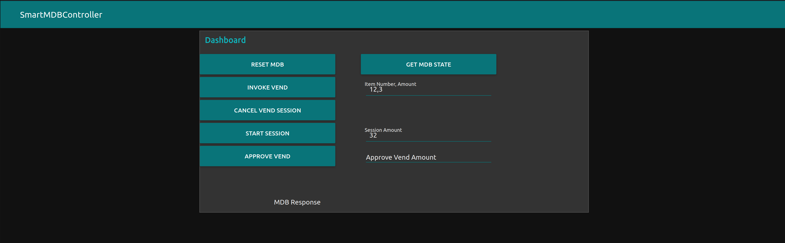

<p align="center">
  <a href="" rel="noopener">
 </a>
</p>

<h3 align="center">Smart MDB Controller</h3>

<div align="center">

[]()


</div>

---


<p align="center"> Smart MDB Controller
    <br> 
</p>

## 📝 Table of Contents

- [About](#about)
- [Getting Started](#getting_started)
- [Prerequisites](#deployment)
- [Installation and Config](#Installation_and_Config)
- [Test](#test)
- [Circuit](#circuit)
- [Dashboard](#dashboard)
- [Built Using](#built_using)
- [Authors](#authors)

## 🧐 About <a name = "about"></a>

This repo contains circuit, firmware and backend for Smart MDB Controller Project.

## 🏁 Getting Started <a name = "getting_started"></a>

These instructions will get you a copy of the project up and running on your local machine for development and testing purposes. See [deployment](#deployment) for notes on how to deploy the project on a live system.

### Prerequisites <a name = "Prerequisites"></a>

What things you need to install the software and how to install them.

```
- Raspberry Pi Model 3B, 3B+, 4B or CM4
```

## Installation and Configuration <a name = "Installation_and_Config"></a>

A step by step series that covers how to get the Firmware running.

### Raspberry Pi Firmware Pre-Reqs

1.  Download and install the latest Raspberry Pi OS Desktop image to your SD card
2.  Open the terminal and execute the following command
    ```sudo raspi-config```
3. Then follow the following pictures to enable I2C bus on you raspberry pi

* 
* 
* 
* 
* 

* Then do the same for Serial(UART)

* 

### Configuring Raspberry Pi and Running the UI
  1.  Copy FirmwareRPi folder to the desktop of your Raspberry Pi, open the terminal of your Raspberry Pi and execute the following commands

```bash
  - sudo apt-get update
  - sudo apt-get upgrade
  - sudo apt install python3-pip
  - pip3 install pyserial
  - pip3 install paho-mqtt
  - sudo adduser $USER dialout
  - cd ~/Desktop/FirmwareRPi
  - sudo chmod a+rx starter.sh
```

1.  To run the program just double click on starter.sh file
  1.  or execute `python3 /home/pi/Desktop/FirmwareRPi/Firmware.py`

This program make use of MQTT to communicate with the webapp.

  ```diff
  + broker used is borker.hivemq.com
  + vending can be done by publishing an ammount to mdb/invoke topic
  ```

### Arduino Mega Configurations
 
 The following packages should be installed on your PC
 
  - AVR-GCC
  - AVRDUDE
  - avr-libc

#### Installing Pre-Reqs on Linux(Ubuntu or Debian Based Distro)

  On Ubuntu or any Debian based Linux distro execute the following commands
```bash
  - sudo apt-get install -y gcc-avr
  - sudo apt-get install -y avrdude
  - sudo apt-get install avr-libc
```

### Setup

  1. Open terminal in the atmega2560FW folder and execute `make clean`
  2. Open makefile, replace P=COM1 to the COM port of your arduino mega and save the file
    1. Compile it with `make all`
  3. Upload it to your Arduino with `make program`


## ⛏️ Testing <a name = "test"></a>

1.  The Firmware can be tested on Raspberry Pi 3B, 3B+ or 4B with the following modifications
  1.  Connect the sensor as shown in the Circuit Diagram section below.

## 🔌 Circuit Diagram <a name = "circuit"></a>


* RPi 3,4 GPIOs Pinout


* Arduino Mega Pinout


### Circuit


```http
Pins connections
```

| Arduino Mega | Logic Level Shifter |
| :--- | :--- |
| `TX2` | `RX1` | 
| `GND` | `GND` |
| `HV` | `5V` | 
| `RX2` | `TX0` | 

| Logic Level Shifter | Raspberry Pi |
| :--- | :--- |
| `RX0` | `UART0_TX` | 
| `GND` | `GND` | 
| `LV` | `3.3V` | 
| `TX1` | `UART0_RX` | 


| SN74HC14 | Arduino Mega |
| :--- | :--- |
| `2` | `RX1` | 
| `3` | `TX1` | 
| `4 & 5` | `Shorted` | 
| `14` | `5V` | 


## Dashboard <a name = "dashboard"></a>

You can use the dashboard with the link below:

[https://nodered-proxy.production.wrapdrive.tech/ui/#!/0](https://nodered-proxy.production.wrapdrive.tech/ui/#!/0)



  ```diff
  - The dashboard is running on a production server that is meant for testing only. 
  
  -You should install and configure the dashboard on your Raspberry Pi or local server to keep it running.
  ```

### Installing and Configuring Node-RED on Raspberry Pi

Conifguring NodeRED, MQTT is required only one time.

Open the terminal and execute the following commands

```
- sudo chmod a+rx starter.sh
- sudo apt install ufw
- sudo ufw enable
- sudo ufw allow tcp http https 1883 8883 1880
```
##### Installing MQTT(Mosquitto)
Open the terminal and execute the following commands

```
- sudo apt install -y mosquitto mosquitto-clients
- sudo systemctl enable mosquitto.service
- mosquitto -v
```
##### Installing and Configuring NodeRED
Open the terminal and execute the following commands

```
- bash <(curl -sL https://raw.githubusercontent.com/node-red/linux-installers/master/deb/update-nodejs-and-nodered)
- sudo systemctl enable nodered.service
- npm install node-red-dashboard 
- sudo npm install node-red-dashboard
- sudo systemctl restart nodered.service
```
Then open NodeRED in your raspberry pi or using any other device which is connected to the same network
as your Raspberry Pi is.
In the browser you can type http://raspberrypi.local:1880 to open the node-red

- Once node-red is opened, click on the menu button on the top left corner of the app and click on import.
- Click on `select file to import` and select flows.json present in the `dashboard` directory of this repo.
- After flows are imported, click on Deploy button on the top of the screen to save the changes.
- You can access the Dashboard using http://raspberrypi.local:1880/ui


## Components Used

1.  [Raspberry Pi](https://www.amazon.com/CanaKit-Raspberry-Micro-Supply-Listed/dp/B01C6FFNY4/ref=sr_1_1?dchild=1&keywords=raspberry+pi+3&qid=1632029848&sr=8-1)
2.  [Logic Level Converter](https://www.amazon.com/SparkFun-Logic-Level-Converter-Bi-Directional/dp/B01N30ZCW9/ref=sr_1_6?crid=2NOGIA43AG9OS&dchild=1&keywords=logic+level+converter&qid=1632029917&sprefix=logic+level%2Caps%2C463&sr=8-6)
3.  [SN74HC14 Hex Inverter](https://www.amazon.com/Todiys-SN74HC14N-HD74HC14P-MC74HC14AN-Inverters/dp/B08CXL3CJY/ref=sr_1_3?crid=3GKSDTJODAZYP&keywords=SN74HC14&qid=1655142247&sprefix=sn74hc14%2Caps%2C172&sr=8-3)
4. [PC817 Optocoupler](https://www.amazon.com/BOJACK-PC817-OPTOCOUPLER-Installation-PC817C/dp/B08CXRHDHP/ref=sr_1_1_sspa?keywords=pc817&qid=1655142297&sr=8-1-spons&psc=1&spLa=ZW5jcnlwdGVkUXVhbGlmaWVyPUE2MUNEUkZEVFVSU1AmZW5jcnlwdGVkSWQ9QTA3ODUwNzlOWUlYVTdBVFFONDYmZW5jcnlwdGVkQWRJZD1BMDI1NjU0MDNGRlpCWUg0NEFOTEMmd2lkZ2V0TmFtZT1zcF9hdGYmYWN0aW9uPWNsaWNrUmVkaXJlY3QmZG9Ob3RMb2dDbGljaz10cnVl)
5.  [Arduino Mega](https://www.amazon.com/ARDUINO-MEGA-2560-REV3-A000067/dp/B0046AMGW0/ref=sr_1_3?crid=1WO7QZXQH3KSE&keywords=arduino+mega&qid=1655142363&sprefix=arduino+meg%2Caps%2C169&sr=8-3)
6. 330 Ohm Resistor
7. 1N4007 Diode

### Datasheets
* Optocoupler __OHPC 817C F919G__
* * [Datasheet](https://www.farnell.com/datasheets/73758.pdf)
* Schimitt Trigger Hex Inverter __PHILIPS 74HC14N B9784PS Hnn9840 E__
* * [Datasheet](https://datasheet.octopart.com/74HC14N-Philips-datasheet-7274161.pdf)
* Diode __1N4007 MIC AXIAL SILASTIC GUARD JUNCTION STANDARD RECTIFIER__
* * [Datasheet](https://rdd-tech.com/sites/default/files/attachment/1N4007%20MIC.pdf)


## ⛏️ Built Using <a name = "built_using"></a>

- [Python3](https://www.python.org/) - Raspberry Pi FW
- [Flutter](https://flutter.dev/) - Cross-Platform Smartphone App Development Framework

## ✍️ Authors <a name = "authors"></a>

- [@Nauman3S](https://github.com/Nauman3S) - Development and Deployment
